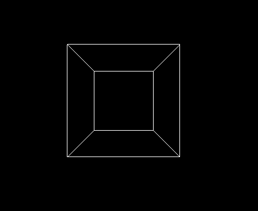
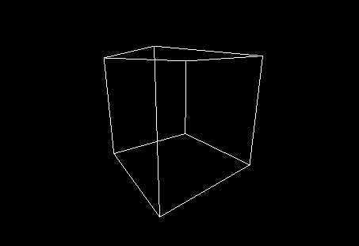
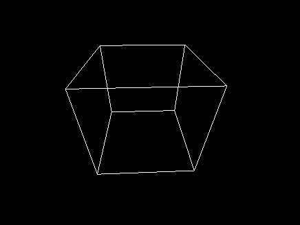

## Wireframe 3D Cube
This project implements teaching frameworks for an introductory computer graphics course.
This project has been done without OpenGl.

1. Class **"Image"** implements a simple matlab-like syntax for generating/showing/saving images. The image is shown on screen using GLFW and openGL. The image is saved to disk using libpng and zlib.
 
2. Class **"Canvas"** implements a simple warpping over GLFW3. Students can simply fill in a few callbacks in main.cpp. Includes:

This framework has been tested on the following platforms :

- OSX Yosemite 10.10.5 + XCode 7.0.1 Build &A1001
- Windows 10.1 + Visual Studio 2013 Community (VS12)

###What have been done
The image renders:
  * 3D cube wireframe cube

Features:
  * Camera rotation with the left mouse button, assuming the camera is at a distance from the cube: when you press the left mouse button down and move the cursor left and right, the camera should rotate around the centre of the object. When you press down the left mouse button and move the cursor up and down, the camera rotates up and down. In both cases the camera should be looking at the centre of the cube or a user specified point
  * Camera moving along the gaze vector with the right mouse button: when press down the right mouse button and move the cursor up and down, the camera moves closer and further away from the cube, but the viewing direction is not changed

###Impage output:

###Useful links:
- GLFW: [http://www.glfw.org/]
- GLEW: [http://glew.sourceforge.net/] (only required on Windows)
- libpng: [http://libpng.org/pub/png/libpng.html]
- zlib: [http://www.zlib.net/]
